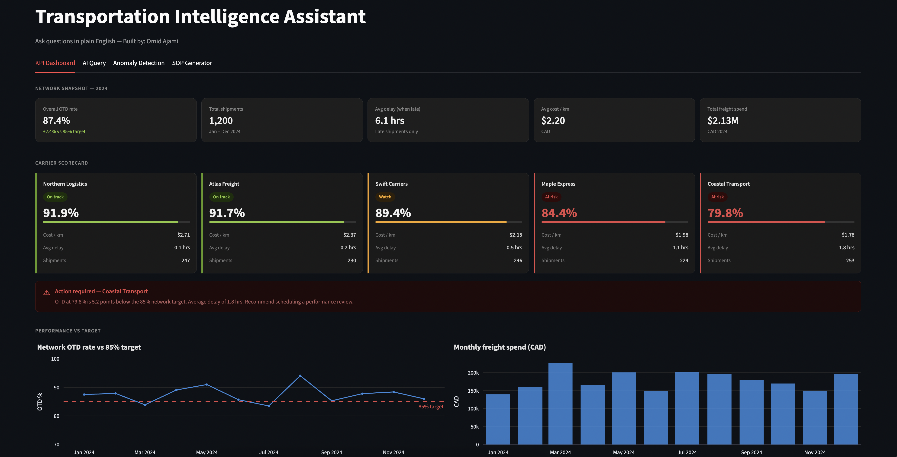
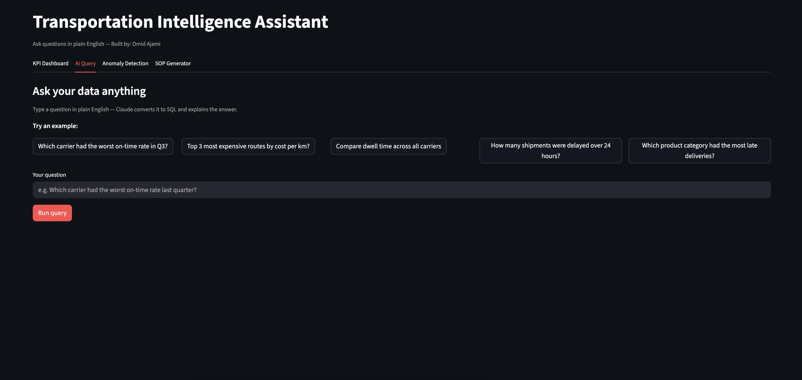
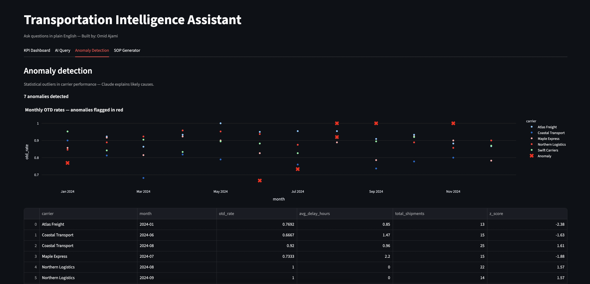
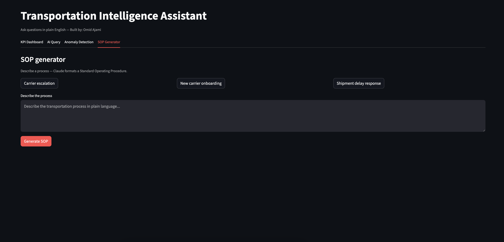

# Transportation Intelligence Assistant

[](https://your-app-name.streamlit.app)
[](https://python.org)
[](https://anthropic.com)
[](https://sqlite.org)

> An AI-powered transportation analytics app that lets anyone query carrier performance data in plain English — no SQL knowledge required.

---

## The problem it solves

Transportation teams spend hours answering ad-hoc data questions from managers and frontline staff. Analysts become bottlenecks — every "which carrier had the worst performance last month?" requires someone to write a SQL query, run it, format the result, and send it back.

This app eliminates that bottleneck. Anyone on the team types a question in plain English, and Claude AI converts it to SQL, runs it, and returns a plain-English insight in seconds.

---

## Features

### KPI Dashboard
Real-time network snapshot with carrier scorecards, traffic-light status indicators, OTD trend vs 85% target, monthly freight spend, cost vs performance scatter, and a delay heatmap by carrier and route region.



### AI Query — natural language to SQL
Type any question in plain English. Claude converts it to SQL, runs it against the database, and explains the result in plain English.

> *"Which carrier had the worst on-time rate in Q3?"*
> *"What are the top 3 most expensive routes by cost per km?"*
> *"How many shipments were delayed more than 24 hours?"*



### Anomaly Detection
Statistical z-score analysis flags unusual dips or spikes in carrier performance. Claude explains what likely caused each anomaly and suggests operational next steps.



### SOP Generator
Paste a process description in plain language — Claude formats a ready-to-use Standard Operating Procedure with numbered steps, roles, and acceptance criteria.



---

## Tech stack

| Layer | Technology |
|---|---|
| Frontend | Streamlit |
| AI | Claude API (Anthropic) — claude-sonnet-4 |
| Database | SQLite + pandas |
| Charts | Plotly |
| Language | Python 3.10+ |
| Hosting | Streamlit Cloud (free) |

---

## Dataset

Synthetic dataset of 1,200 Canadian freight shipments across 5 carriers and 8 national routes (2024). Includes a realistic anomaly baked into Coastal Transport's March performance — used to demonstrate the anomaly detection feature.

**Carriers:** Atlas Freight, Maple Express, Northern Logistics, Swift Carriers, Coastal Transport
**Routes:** Toronto–Montreal, Vancouver–Calgary, Montreal–Halifax, Halifax–Charlottetown (PEI), and more

---

## Setup

### 1. Clone the repo
```bash
git clone https://github.com/omidajami/transport-ai-assistant.git
cd transport-ai-assistant
```

### 2. Create virtual environment
```bash
python3 -m venv venv
source venv/bin/activate
```

### 3. Install dependencies
```bash
pip install -r requirements.txt
```

### 4. Generate the database
```bash
python3 generate_data.py
```

### 5. Get your Anthropic API key
Sign up at [console.anthropic.com](https://console.anthropic.com) → API Keys → Create Key.
Add $5 in credits — enough for hundreds of queries.

### 6. Run the app
```bash
streamlit run app.py
```

Paste your API key in the sidebar when the app opens.

---

## Deploy free on Streamlit Cloud

1. Push this repo to GitHub
2. Go to [share.streamlit.io](https://share.streamlit.io)
3. Connect your GitHub account and select this repo
4. Under **Advanced settings → Secrets**, add:
```toml
ANTHROPIC_API_KEY = "sk-ant-your-key-here"
```
5. Click Deploy — live in under 2 minutes

---

## About

Built by **Omid Ajami** as a portfolio project targeting transportation analytics roles at companies like Walmart Canada, Amazon Logistics, and Loblaw.

This project demonstrates:
- End-to-end data pipeline design (synthetic data generation → SQLite → Streamlit)
- Generative AI integration using the Claude API
- Transportation domain knowledge (OTD, OTIF, dwell time, carrier scorecards)
- Production-ready app deployment

**Connect:** [LinkedIn](https://linkedin.com/in/omidajami) · [Portfolio](https://omidajami.github.io)
